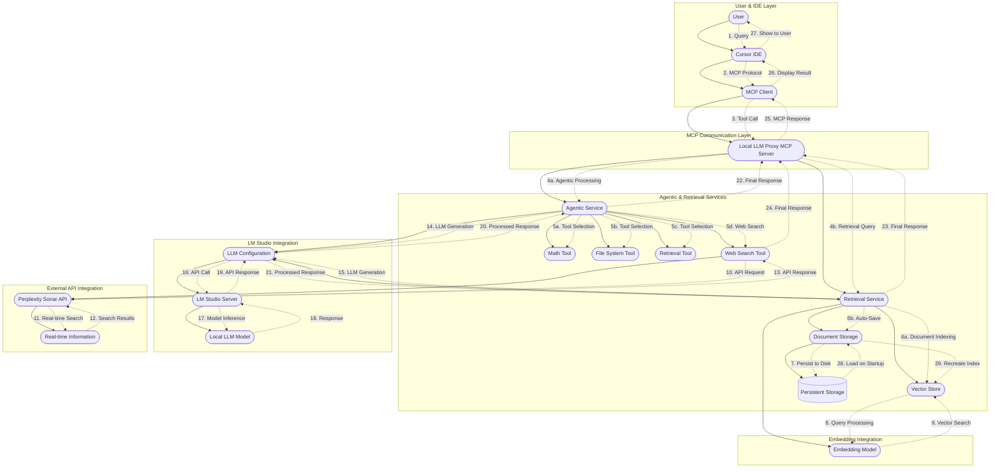

# Enhanced Local LLM Proxy MCP Server

A TypeScript-based MCP (Model Context Protocol) server that enhances local LLM capabilities with agentic behavior, retrieval-augmented responses, and dynamic tool integration.

This server is compatible with Cursor and similar IDEs supporting MCP client definitions similar to Cursor's `mcp.json`. The server's goal is to take load (and budgeting) off the more powerful cloud-based LLMs in Cursor (and similar) and use them for either validation purposes against the locally prompted LLMs, and/or fallback system.  

The project's goal and current minimal functionalities also aims at equipping your LM-studio local agent with agentic tools like RAG, memory graphs, math calculations and more, such that the locally-provided answer's accuracy is futher increased, decreasing the likelihood of interaction with the more expensive cloud-native models.

> **Compatibility note:** The current tool-calling stack has been exercised in LM Studio with `openai/gpt-oss-120b`, `qwen2.5-coder-32b-instruct`, and `qwen3-coder-32b-instruct`. Other models may require prompt or temperature tuning.

> **LM Studio logging:** Because we format tool calls manually, the LM Studio JSON logs show an empty `tool_calls` array; the serialized tool request is embedded in the assistant `content` block instead. This is expected.

## 🔄 Architecture & Workflow



## 🚀 Features

### 🧠 Agentic Capabilities
- **Math Tool**: Performs basic mathematical operations (add, subtract, multiply, divide)
- **File System Tool**: Read, write, and list files and directories
- **RAG System**: Document indexing and querying with natural language

### 🔍 RAG (Retrieval-Augmented Generation)
- Index documents from files or direct text input
- Query indexed documents with natural language
- Source attribution for responses
- Persistent document storage across Cursor restarts
- Automatic document loading on server startup
- File-based persistence with configurable storage path

### 🎯 MCP Orchestrator
- **Tool Discovery**: Automatically discovers and connects to other MCP servers
- **Intelligent Tool Selection**: Uses rule-based logic to select appropriate tools for queries
- **Web Search Priority**: Automatically routes web search queries to Sonar API
- **Dual Rule System**: Separates general functionality rules from personal preferences
- **Fallback Communication**: Provides targeted error reporting for Cursor fallback
- **Context-Aware Processing**: Gathers context from multiple MCP servers before tool execution
- **Validation & Quality Control**: Ensures response quality and accuracy

### 🛠 Available MCP Tools
1. `generate_text_v2` - Generate text with agentic capabilities
2. `chat_completion` - Chat completion with tool integration
3. `rag_query` - Query indexed documents using RAG
4. `index_document` - Index documents for RAG queries
5. `save_rag_storage` - Manually save RAG documents to disk
6. `clear_rag_storage` - Clear all persistent RAG storage
7. `rag_storage_status` - Get RAG storage status and persistence info
8. `sonar_query` - Real-time information gathering with Perplexity Sonar API
9. `delegate_to_local_llm` - Delegate requests to the local LLM orchestrator
10. `orchestrator_status` - Get orchestrator status and connected tools
11. `list_orchestrated_tools` - List all available orchestrated tools
12. `call_orchestrated_tool` - Call specific orchestrated tools directly

### 🌐 LM Studio Integration
- OpenAI-compatible API integration
- Support for Quen3 and other local models
- Configurable base URL and model selection
- Environment variable configuration

### 🎯 MCP Orchestrator
- **Tool Discovery**: Automatically discovers and connects to other MCP servers
- **Intelligent Routing**: Routes queries to appropriate tools based on content analysis
- **Web Search Integration**: Prioritizes real-time information gathering with Sonar API
- **Fallback System**: Graceful fallback to Cursor when needed
- **Rules-Based Selection**: Configurable rules for tool selection and usage

### 🔄 Intelligent Validation & Fallback System
- **Heuristic-based validation** for response quality assessment
- **Automatic fallback** to cloud LLMs when local responses are inadequate
- **Smart tool selection** with enhanced sequential thinking integration
- **Real-time validation** checking for errors, inability expressions, and response completeness
- **Configurable thresholds** for confidence scoring and fallback triggers

### 📋 Configuration & Rules
- **Cursor Delegation Rules**: See [CURSOR_DELEGATION_RULES.md](./CURSOR_DELEGATION_RULES.md) for IDE integration guidelines
- **Delegation Implementation Guide**: See [DELEGATION_IMPLEMENTATION_GUIDE.md](./DELEGATION_IMPLEMENTATION_GUIDE.md) for complete system setup
- **MCP Orchestrator Rules**: See [mcp-orchestrator-rules.example.json](./mcp-orchestrator-rules.example.json) for server-side rule configuration
- **Customizable rule engine** for tool usage policies and validation behavior
- **Environment-based configuration** with sensible defaults

## 📦 Installation

### Prerequisites
- Node.js 18+ 
- LM Studio installed and running
- Git (for cloning the repository)

### Setup
1. **Clone the repository:**
```bash
git clone https://github.com/Davz33/Cursor-Local-llm-MCP-proxy
cd local-llm-proxy
```

2. **Install dependencies:**
```bash
npm install
```

3. **Build the TypeScript project:**
```bash
npm run build
```

4. **(Optional) Bootstrap the Pixi environment for DeepEval tests:**
```bash
# install Pixi if you don't already have it: https://pixi.sh/latest/
pixi install
```

**⚠️ Important:** You must build the project before using it with MCP clients like Cursor.

## 🚀 Usage

### 1. Start LM Studio
1. Download and install [LM Studio](https://lmstudio.ai/)
2. Load your preferred model (e.g., Qwen3, Llama, etc.)
3. Start the server on `http://localhost:1234/v1`

### 2. Configure Environment (Optional)
```bash
export LM_STUDIO_BASE_URL="http://localhost:1234/v1"
export LM_STUDIO_MODEL="qwen3-coder-30b-a3b-instruct"
```

### 3. Configure MCP Client (Cursor/IDE)

Add the following configuration to your MCP client (e.g., Cursor's `mcp.json`):

```json
{
  "mcpServers": {
    "local-llm-proxy": {
      "command": "node",
      "args": ["/path/to/your/local-llm-proxy/dist/index.js"],
      "env": {
        "LM_STUDIO_BASE_URL": "http://localhost:1234/v1",
        "LM_STUDIO_MODEL": "qwen3-coder-30b-a3b-instruct"
      }
    }
  }
}
```

**Replace `/path/to/your/local-llm-proxy` with the actual path to your cloned repository.**

### 4. Install the System Prompt in LM Studio

1. Open the file `prompts/agentic-system-prompt.md` and copy its contents.
2. In LM Studio, either:
   - Paste the prompt into your active preset via the UI, or
   - Edit `~/.lmstudio/config-presets/<your-preset>.json` and update `operation.fields.value` with the prompt text.
3. Restart the preset in LM Studio so the prompt is picked up before running evaluations.

### 5. Start the MCP Server

**Production:**
```bash
npm start
```

**Development (with hot reload):**
```bash
npm run dev
```

**Build TypeScript:**
```bash
npm run build
```

**Note:** The MCP server runs automatically when called by your MCP client (like Cursor). You don't need to manually start it in most cases.

## 🔧 Configuration

The server can be configured using environment variables:

- `LM_STUDIO_BASE_URL`: LM Studio API endpoint (default: `http://localhost:1234/v1`)
- `LM_STUDIO_MODEL`: Model name in LM Studio (default: `qwen3`)

### Real-time Information with Sonar API

For real-time information gathering capabilities, the server includes Perplexity Sonar API integration. See [SONAR_INTEGRATION_README.md](SONAR_INTEGRATION_README.md) for detailed setup instructions including:

- API key configuration
- Environment variable setup
- Usage examples
- Cost considerations

### Orchestration Rules System

The MCP orchestrator uses a dual-rule system to separate general functionality from personal preferences:

#### General Rules (Repository-tracked)
- **Location**: `src/orchestrator/general-orchestration-rules.txt`
- **Purpose**: Core MCP server functionality and tool orchestration logic
- **Content**: Tool selection, error handling, web search patterns, memory operations, thinking operations
- **Maintenance**: Version-controlled and shared across all users

#### Personal Rules (User-specific)
- **Location**: `$HOME/local-llm-proxy/personal-orchestration-rules.txt`
- **Purpose**: Subjective preferences and personal workflow rules
- **Content**: Git preferences, coding style, development workflow, personal context preferences
- **Maintenance**: User-specific and customizable

#### Environment Variables
- `MCP_PERSONAL_RULES_PATH`: Custom path for personal rules (optional)
- Default personal rules location: `$HOME/local-llm-proxy/personal-orchestration-rules.txt`

#### Rule Combination
The orchestrator automatically combines both rule sets:
1. Loads general rules from the repository
2. Loads personal rules from user directory (if exists)
3. Combines them for comprehensive orchestration behavior
4. Falls back gracefully if either file is missing

## 📋 API Examples

### Basic Text Generation
```json
{
  "name": "generate_text_v2",
  "arguments": {
    "prompt": "Explain quantum computing in simple terms",
    "use_agentic": true,
    "max_tokens": 500,
    "temperature": 0.7
  }
}
```

### Chat Completion
```json
{
  "name": "chat_completion",
  "arguments": {
    "messages": [
      {"role": "user", "content": "Can you help me calculate the area of a circle with radius 5?"}
    ],
    "use_agentic": true,
    "max_tokens": 300
  }
}
```

### RAG Document Indexing
```json
{
  "name": "index_document",
  "arguments": {
    "file_path": "/path/to/document.txt"
  }
}
```

**Or index text content directly:**
```json
{
  "name": "index_document",
  "arguments": {
    "text_content": "Your text content to index for RAG queries"
  }
}
```

### RAG Query
```json
{
  "name": "rag_query",
  "arguments": {
    "query": "What are the main concepts discussed?",
    "max_tokens": 300
  }
}
```

### RAG Storage Management
```json
{
  "name": "save_rag_storage",
  "arguments": {}
}
```

```json
{
  "name": "rag_storage_status",
  "arguments": {}
}
```

```json
{
  "name": "clear_rag_storage",
  "arguments": {}
}
```

## 🧪 Testing

The server includes comprehensive testing capabilities:

```bash
# Build the project first
npm run build

# Test basic functionality
npm start

# Test with validation enabled
npm run start:with-validation

# Development mode with hot reload
npm run dev
```

### DeepEval Tool-Calling Regression

Run automated DeepEval checks to ensure tool-calling behavior remains stable:

```bash
npm run build
pixi install            # one-time environment bootstrap
pixi run evaluate-tool-calling

# alternatively, if you already activated Pixi:
python deepeval/evaluate_tool_calling.py
```

### Testing MCP Tools
Once configured in your MCP client, you can test the tools:

1. **Generate Text:** Use `mcp_local-llm-proxy_generate_text_v2` in your IDE
2. **Chat Completion:** Use `mcp_local-llm-proxy_chat_completion` 
3. **RAG Query:** Use `mcp_local-llm-proxy_rag_query`
4. **Index Document:** Use `mcp_local-llm-proxy_index_document`

## 🏗 Architecture

### Modular Structure
```
src/
├── config/
│   └── llm-config.ts          # LLM and embedding model configuration
├── rag/
│   └── rag-service.ts         # RAG functionality and document indexing
├── agentic/
│   └── agentic-service.ts     # Agentic LLM interactions with tools
├── tools/
│   └── agentic-tools.ts       # Tool definitions (math, filesystem, RAG)
└── mcp/
    └── mcp-server.ts          # MCP server implementation
```

### Core Components
- **MCP Server**: TypeScript-based Model Context Protocol communication
- **Retrieval Engine**: Embedding-powered document indexing with deterministic storage
- **LM Studio Adapter**: OpenAI-compatible API integration
- **RAG Service**: Document indexing and querying with HuggingFace embeddings
- **Agentic Service**: Tool-integrated LLM interactions
- **Modular Tools**: Extensible tool architecture with full type safety

### Tool Architecture
```typescript
interface Tool {
  name: string;
  description: string;
  execute: (params: any, context?: ToolExecutionContext) => Promise<string>;
}

const tool: Tool = {
  name: "tool_name",
  description: "Tool description",
  execute: async (params, context) => {
    // Tool implementation with full type safety
  }
};
```

## 🔍 RAG Workflow

1. **Document Indexing**: Documents are processed and stored in a vector index
2. **Automatic Persistence**: Documents are automatically saved to disk after indexing
3. **Query Processing**: Natural language queries are converted to vector searches
4. **Context Retrieval**: Relevant document chunks are retrieved
5. **Response Generation**: LLM generates responses using retrieved context
6. **Source Attribution**: Responses include source document information
7. **Cross-Session Persistence**: Documents persist across Cursor restarts and server restarts

## 🚨 Troubleshooting

### Common Issues
1. **Connection Refused**: Ensure LM Studio server is running on `http://localhost:1234/v1`
2. **Model Not Found**: Verify model name in LM Studio matches your configuration
3. **Port Conflicts**: Change LM Studio port if needed and update configuration
4. **Memory Issues**: Reduce model size or increase system memory
5. **Tool Not Found**: Ensure you've built the project with `npm run build`
6. **MCP Client Issues**: Restart your MCP client (Cursor) after configuration changes

### Debug Mode
```bash
DEBUG=* npm start
```

### MCP Configuration Issues
- **Tool Grayed Out**: This usually indicates a caching issue. Try:
  1. Disable and re-enable the MCP integration in Cursor
  2. Restart Cursor completely
  3. Check that the path in `mcp.json` points to `dist/index.js`

## 📈 Performance Tips

- Use quantized models for better performance
- Adjust `max_tokens` based on your needs
- Enable streaming for long responses
- Use RAG for document-heavy queries
- Monitor memory usage with large documents

## 🔮 Future Enhancements

- [ ] Multi-agent workflows with handoffs
- [ ] Advanced streaming with real-time updates
- [x] **Persistent document storage across sessions** ✅
- [ ] Custom tool development framework
- [ ] Performance monitoring and metrics
- [ ] Integration with more LLM providers

## 📄 License

GPL 3.0 License - see COPYING file for details

## 🤝 Contributing

Contributions are welcome! Please feel free to submit issues and pull requests.

## 📞 Support

For support and questions:
- Create an issue in the repository
- Check the troubleshooting section
- Review the LM Studio configuration guide

## 📝 Quick Start Guide

1. **Clone and Setup:**
   ```bash
   git clone https://github.com/Davz33/Cursor-Local-llm-MCP-proxy
   cd local-llm-proxy
   npm install
   npm run build
   ```

2. **Start LM Studio:**
   - Download and install [LM Studio](https://lmstudio.ai/)
   - Load a model (e.g., Qwen3, Llama)
   - Start server on `http://localhost:1234/v1`

3. **Configure Cursor:**
   - Add the MCP configuration to your `mcp.json`
   - Update the path to point to your `dist/index.js`
   - Restart Cursor

4. **Test:**
   - Use `mcp_local-llm-proxy_generate_text_v2` in Cursor
   - Try `mcp_local-llm-proxy_chat_completion` with agentic capabilities
   - Index documents with `mcp_local-llm-proxy_index_document`
   - Query with `mcp_local-llm-proxy_rag_query`
   - **Test persistence**: Index documents, restart Cursor, and query again - your documents will persist!
