# Enhanced Local LLM Proxy MCP Server with LlamaIndex.TS

A powerful TypeScript-based MCP (Model Context Protocol) server that enhances local LLM capabilities with agentic behavior, RAG (Retrieval-Augmented Generation), and tool integration using LlamaIndex.TS.

This server is compatible with Cursor and similar IDEs supporting MCP client definitions similar to Cursor's `mcp.json`. The server's goal is to take load (and budgeting) off the more powerful cloud-based LLMs in Cursor (and similar) and use them for either validation purposes against the locally prompted LLMs, and/or fallback system.  

The project's goal and current minimal functionalities also aims at equipping your LM-studio local agent with agentic tools like RAG, memory graphs, math calculations and more, such that the locally-provided answer's accuracy is futher increased, decreasing the likelihood of interaction with the more expensive cloud-native models.

## 🔄 Architecture & Workflow

```mermaid
graph TB
    %% User and IDE Layer
    User[👤 User] --> Cursor[🖥️ Cursor IDE]
    Cursor --> MCPClient[MCP Client]
    
    %% MCP Communication Layer
    MCPClient --> MCPServer[🔧 Local LLM Proxy MCP Server]
    MCPServer --> AgenticService[🧠 Agentic Service]
    MCPServer --> RAGService[📚 RAG Service]
    
    %% Agentic Capabilities
    AgenticService --> MathTool[➕ Math Tool]
    AgenticService --> FileSystemTool[📁 File System Tool]
    AgenticService --> RAGTool[🔍 RAG Tool]
    
    %% RAG Persistence Layer
    RAGService --> VectorIndex[🗃️ Vector Store Index]
    RAGService --> DocumentStorage[💾 Document Storage]
    DocumentStorage --> DiskStorage[(💿 Persistent Storage)]
    
    %% LM Studio Integration
    AgenticService --> LLMConfig[⚙️ LLM Configuration]
    RAGService --> LLMConfig
    LLMConfig --> LMStudio[🤖 LM Studio Server]
    LMStudio --> LocalModel[🧠 Local LLM Model]
    
    %% Embedding Integration
    RAGService --> EmbeddingModel[🔤 HuggingFace Embeddings]
    
    %% Data Flow
    User -->|"1. Query/Request"| Cursor
    Cursor -->|"2. MCP Protocol"| MCPClient
    MCPClient -->|"3. Tool Call"| MCPServer
    
    MCPServer -->|"4a. Agentic Processing"| AgenticService
    MCPServer -->|"4b. RAG Query"| RAGService
    
    AgenticService -->|"5a. Tool Selection"| MathTool
    AgenticService -->|"5b. Tool Selection"| FileSystemTool
    AgenticService -->|"5c. Tool Selection"| RAGTool
    
    RAGService -->|"6a. Document Indexing"| VectorIndex
    RAGService -->|"6b. Auto-Save"| DocumentStorage
    DocumentStorage -->|"7. Persist to Disk"| DiskStorage
    
    VectorIndex -->|"8. Query Processing"| EmbeddingModel
    EmbeddingModel -->|"9. Vector Search"| VectorIndex
    
    AgenticService -->|"10. LLM Generation"| LLMConfig
    RAGService -->|"11. LLM Generation"| LLMConfig
    LLMConfig -->|"12. API Call"| LMStudio
    LMStudio -->|"13. Model Inference"| LocalModel
    
    LocalModel -->|"14. Response"| LMStudio
    LMStudio -->|"15. API Response"| LLMConfig
    LLMConfig -->|"16. Processed Response"| AgenticService
    LLMConfig -->|"17. Processed Response"| RAGService
    
    AgenticService -->|"18. Final Response"| MCPServer
    RAGService -->|"19. Final Response"| MCPServer
    MCPServer -->|"20. MCP Response"| MCPClient
    MCPClient -->|"21. Display Result"| Cursor
    Cursor -->|"22. Show to User"| User
    
    %% Persistence Flow
    DiskStorage -.->|"23. Load on Startup"| DocumentStorage
    DocumentStorage -.->|"24. Recreate Index"| VectorIndex
    
    %% Styling
    classDef userLayer fill:#e1f5fe,stroke:#01579b,stroke-width:2px
    classDef mcpLayer fill:#f3e5f5,stroke:#4a148c,stroke-width:2px
    classDef serviceLayer fill:#e8f5e8,stroke:#1b5e20,stroke-width:2px
    classDef toolLayer fill:#fff3e0,stroke:#e65100,stroke-width:2px
    classDef storageLayer fill:#fce4ec,stroke:#880e4f,stroke-width:2px
    classDef llmLayer fill:#e0f2f1,stroke:#004d40,stroke-width:2px
    
    class User,Cursor userLayer
    class MCPClient,MCPServer mcpLayer
    class AgenticService,RAGService serviceLayer
    class MathTool,FileSystemTool,RAGTool toolLayer
    class VectorIndex,DocumentStorage,DiskStorage storageLayer
    class LLMConfig,LMStudio,LocalModel,EmbeddingModel llmLayer
```



## 🚀 Features

### 🧠 Agentic Capabilities
- **Math Tool**: Performs basic mathematical operations (add, subtract, multiply, divide)
- **File System Tool**: Read, write, and list files and directories
- **RAG System**: Document indexing and querying with natural language

### 🔍 RAG (Retrieval-Augmented Generation)
- Index documents from files or direct text input
- Query indexed documents with natural language
- Source attribution for responses
- Persistent document storage across Cursor restarts
- Automatic document loading on server startup
- File-based persistence with configurable storage path

### 🛠 Available MCP Tools
1. `generate_text_v2` - Generate text with agentic capabilities
2. `chat_completion` - Chat completion with tool integration
3. `rag_query` - Query indexed documents using RAG
4. `index_document` - Index documents for RAG queries
5. `save_rag_storage` - Manually save RAG documents to disk
6. `clear_rag_storage` - Clear all persistent RAG storage
7. `rag_storage_status` - Get RAG storage status and persistence info

### 🌐 LM Studio Integration
- OpenAI-compatible API integration
- Support for Quen3 and other local models
- Configurable base URL and model selection
- Environment variable configuration

## 📦 Installation

### Prerequisites
- Node.js 18+ 
- LM Studio installed and running
- Git (for cloning the repository)

### Setup
1. **Clone the repository:**
```bash
git clone https://github.com/Davz33/Cursor-Local-llm-MCP-proxy
cd local-llm-proxy
```

2. **Install dependencies:**
```bash
npm install
```

3. **Build the TypeScript project:**
```bash
npm run build
```

**⚠️ Important:** You must build the project before using it with MCP clients like Cursor.

## 🚀 Usage

### 1. Start LM Studio
1. Download and install [LM Studio](https://lmstudio.ai/)
2. Load your preferred model (e.g., Qwen3, Llama, etc.)
3. Start the server on `http://localhost:1234/v1`

### 2. Configure Environment (Optional)
```bash
export LM_STUDIO_BASE_URL="http://localhost:1234/v1"
export LM_STUDIO_MODEL="qwen3-coder-30b-a3b-instruct"
```

### 3. Configure MCP Client (Cursor/IDE)

Add the following configuration to your MCP client (e.g., Cursor's `mcp.json`):

```json
{
  "mcpServers": {
    "local-llm-proxy": {
      "command": "node",
      "args": ["/path/to/your/local-llm-proxy/dist/index.js"],
      "env": {
        "LM_STUDIO_BASE_URL": "http://localhost:1234/v1",
        "LM_STUDIO_MODEL": "qwen3-coder-30b-a3b-instruct"
      }
    }
  }
}
```

**Replace `/path/to/your/local-llm-proxy` with the actual path to your cloned repository.**

### 4. Start the MCP Server

**Production:**
```bash
npm start
```

**Development (with hot reload):**
```bash
npm run dev
```

**Build TypeScript:**
```bash
npm run build
```

**Note:** The MCP server runs automatically when called by your MCP client (like Cursor). You don't need to manually start it in most cases.

## 🔧 Configuration

The server can be configured using environment variables:

- `LM_STUDIO_BASE_URL`: LM Studio API endpoint (default: `http://localhost:1234/v1`)
- `LM_STUDIO_MODEL`: Model name in LM Studio (default: `qwen3`)

## 📋 API Examples

### Basic Text Generation
```json
{
  "name": "generate_text_v2",
  "arguments": {
    "prompt": "Explain quantum computing in simple terms",
    "use_agentic": true,
    "max_tokens": 500,
    "temperature": 0.7
  }
}
```

### Chat Completion
```json
{
  "name": "chat_completion",
  "arguments": {
    "messages": [
      {"role": "user", "content": "Can you help me calculate the area of a circle with radius 5?"}
    ],
    "use_agentic": true,
    "max_tokens": 300
  }
}
```

### RAG Document Indexing
```json
{
  "name": "index_document",
  "arguments": {
    "file_path": "/path/to/document.txt"
  }
}
```

**Or index text content directly:**
```json
{
  "name": "index_document",
  "arguments": {
    "text_content": "Your text content to index for RAG queries"
  }
}
```

### RAG Query
```json
{
  "name": "rag_query",
  "arguments": {
    "query": "What are the main concepts discussed?",
    "max_tokens": 300
  }
}
```

### RAG Storage Management
```json
{
  "name": "save_rag_storage",
  "arguments": {}
}
```

```json
{
  "name": "rag_storage_status",
  "arguments": {}
}
```

```json
{
  "name": "clear_rag_storage",
  "arguments": {}
}
```

## 🧪 Testing

The server includes comprehensive testing capabilities:

```bash
# Build the project first
npm run build

# Test basic functionality
npm start

# Test with validation enabled
npm run start:with-validation

# Development mode with hot reload
npm run dev
```

### Testing MCP Tools
Once configured in your MCP client, you can test the tools:

1. **Generate Text:** Use `mcp_local-llm-proxy_generate_text_v2` in your IDE
2. **Chat Completion:** Use `mcp_local-llm-proxy_chat_completion` 
3. **RAG Query:** Use `mcp_local-llm-proxy_rag_query`
4. **Index Document:** Use `mcp_local-llm-proxy_index_document`

## 🏗 Architecture

### Modular Structure
```
src/
├── config/
│   └── llm-config.ts          # LLM and embedding model configuration
├── rag/
│   └── rag-service.ts         # RAG functionality and document indexing
├── agentic/
│   └── agentic-service.ts     # Agentic LLM interactions with tools
├── tools/
│   └── agentic-tools.ts       # Tool definitions (math, filesystem, RAG)
└── mcp/
    └── mcp-server.ts          # MCP server implementation
```

### Core Components
- **MCP Server**: TypeScript-based Model Context Protocol communication
- **LlamaIndex.TS Integration**: Modern v0.11.28 with Settings API
- **LM Studio Adapter**: OpenAI-compatible API integration
- **RAG Service**: Document indexing and querying with HuggingFace embeddings
- **Agentic Service**: Tool-integrated LLM interactions
- **Modular Tools**: Extensible tool architecture with full type safety

### Tool Architecture
```typescript
interface Tool {
  name: string;
  description: string;
  execute: (params: any, context?: ToolExecutionContext) => Promise<string>;
}

const tool: Tool = {
  name: "tool_name",
  description: "Tool description",
  execute: async (params, context) => {
    // Tool implementation with full type safety
  }
};
```

## 🔍 RAG Workflow

1. **Document Indexing**: Documents are processed and stored in a vector index
2. **Automatic Persistence**: Documents are automatically saved to disk after indexing
3. **Query Processing**: Natural language queries are converted to vector searches
4. **Context Retrieval**: Relevant document chunks are retrieved
5. **Response Generation**: LLM generates responses using retrieved context
6. **Source Attribution**: Responses include source document information
7. **Cross-Session Persistence**: Documents persist across Cursor restarts and server restarts

## 🚨 Troubleshooting

### Common Issues
1. **Connection Refused**: Ensure LM Studio server is running on `http://localhost:1234/v1`
2. **Model Not Found**: Verify model name in LM Studio matches your configuration
3. **Port Conflicts**: Change LM Studio port if needed and update configuration
4. **Memory Issues**: Reduce model size or increase system memory
5. **Tool Not Found**: Ensure you've built the project with `npm run build`
6. **MCP Client Issues**: Restart your MCP client (Cursor) after configuration changes

### Debug Mode
```bash
DEBUG=* npm start
```

### MCP Configuration Issues
- **Tool Grayed Out**: This usually indicates a caching issue. Try:
  1. Disable and re-enable the MCP integration in Cursor
  2. Restart Cursor completely
  3. Check that the path in `mcp.json` points to `dist/index.js`

## 📈 Performance Tips

- Use quantized models for better performance
- Adjust `max_tokens` based on your needs
- Enable streaming for long responses
- Use RAG for document-heavy queries
- Monitor memory usage with large documents

## 🔮 Future Enhancements

- [ ] Multi-agent workflows with handoffs
- [ ] Advanced streaming with real-time updates
- [x] **Persistent document storage across sessions** ✅
- [ ] Custom tool development framework
- [ ] Performance monitoring and metrics
- [ ] Integration with more LLM providers

## 📄 License

GPL 3.0 License - see COPYING file for details

## 🤝 Contributing

Contributions are welcome! Please feel free to submit issues and pull requests.

## 📞 Support

For support and questions:
- Create an issue in the repository
- Check the troubleshooting section
- Review the LM Studio configuration guide

## 📝 Quick Start Guide

1. **Clone and Setup:**
   ```bash
   git clone https://github.com/Davz33/Cursor-Local-llm-MCP-proxy
   cd local-llm-proxy
   npm install
   npm run build
   ```

2. **Start LM Studio:**
   - Download and install [LM Studio](https://lmstudio.ai/)
   - Load a model (e.g., Qwen3, Llama)
   - Start server on `http://localhost:1234/v1`

3. **Configure Cursor:**
   - Add the MCP configuration to your `mcp.json`
   - Update the path to point to your `dist/index.js`
   - Restart Cursor

4. **Test:**
   - Use `mcp_local-llm-proxy_generate_text_v2` in Cursor
   - Try `mcp_local-llm-proxy_chat_completion` with agentic capabilities
   - Index documents with `mcp_local-llm-proxy_index_document`
   - Query with `mcp_local-llm-proxy_rag_query`
   - **Test persistence**: Index documents, restart Cursor, and query again - your documents will persist!
